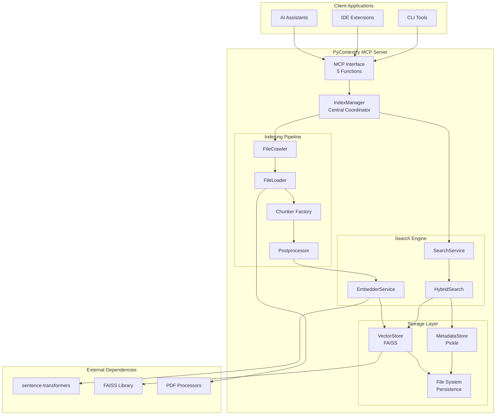
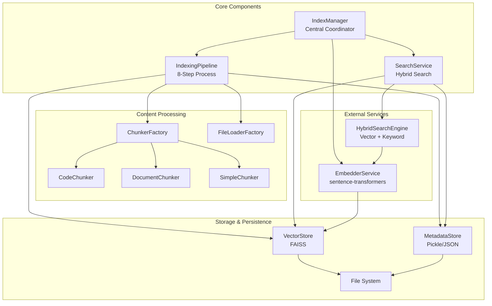
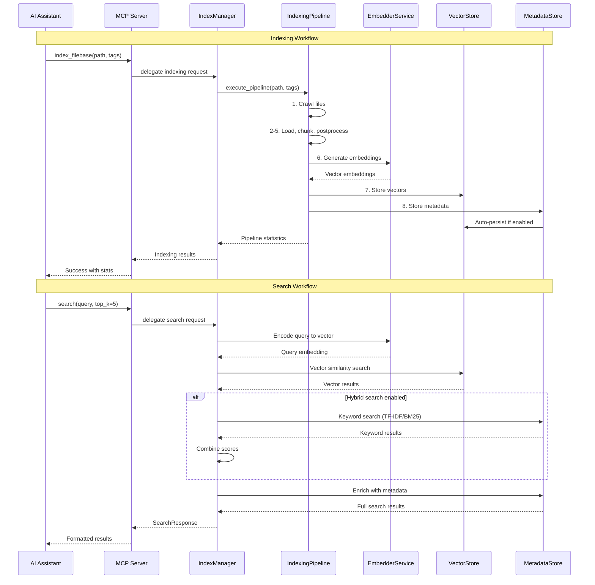

# pycontextify Architecture Document

This document outlines the overall project architecture for pycontextify, including backend systems, shared services, and non-UI specific concerns. Its primary goal is to serve as the guiding architectural blueprint for AI-driven development, ensuring consistency and adherence to chosen patterns and technologies.

**Relationship to Frontend Architecture:**
This project is a Python MCP (Model Context Protocol) server with no frontend components. It provides programmatic access through the MCP protocol for AI assistants and other client applications.

## Starter Template or Existing Project

N/A - This is a greenfield Python project built with modern tooling (UV package manager, FAISS vector search, sentence-transformers) without using a starter template.

## Change Log

| Date | Version | Description | Author |
|------|---------|-------------|---------|
| 2025-01-15 | 1.0 | Initial architecture document | AI Assistant |

## High Level Architecture

### Technical Summary

PyContextify follows a modular MCP server architecture built in Python, providing semantic search capabilities over diverse knowledge sources. The system combines FAISS vector similarity search with TF-IDF/BM25 keyword search to enable hybrid retrieval. Key components include a configurable indexing pipeline with content-aware chunkers, pluggable embedding providers, and lightweight relationship extraction. The architecture supports self-hosted deployment with file-based persistence, ensuring data privacy while providing fast startup through pre-loaded models and lazy loading patterns.

### High Level Overview

1. **Architectural Style**: Monolithic MCP server with modular internal components
2. **Repository Structure**: Single repository (monorepo) with clean separation of concerns
3. **Service Architecture**: Self-hosted Python server exposing 5 MCP functions
4. **User Interaction Flow**: 
   - AI assistants connect via MCP protocol
   - Users index content through `index_filebase()` function
   - Semantic search via `search()` with hybrid vector + keyword capabilities
   - Administrative functions: `discover()`, `status()`, `reset_index()`
5. **Key Architectural Decisions**:
   - **File-based persistence**: No external database dependency
   - **Pre-loaded models**: Embedders initialize at startup for fast first requests
   - **Hybrid search**: Combines vector similarity with keyword matching
   - **Content-aware processing**: Specialized chunkers for code vs. documents

### High Level Project Diagram



### Architectural and Design Patterns

- **MCP Server Pattern:** Standardized protocol interface for AI assistant integration - *Rationale:* Enables seamless integration with Claude, other AI assistants, and development tools
- **Pipeline Pattern:** 8-step indexing process (Crawl → Load → Chunk → Postprocess → Embed → Store) - *Rationale:* Clear separation of concerns and error handling at each stage
- **Factory Pattern:** ChunkerFactory, FileLoaderFactory, EmbedderFactory - *Rationale:* Supports extensibility for new file types and embedding providers
- **Strategy Pattern:** Content-aware chunking (CodeChunker, DocumentChunker, SimpleChunker) - *Rationale:* Optimizes chunking for different content types while maintaining consistent interface
- **Service Layer Pattern:** SearchService, EmbedderService coordinate complex operations - *Rationale:* Encapsulates business logic and enables clean testing boundaries
- **Configuration Pattern:** Environment variables > CLI args > defaults with validation - *Rationale:* Flexible deployment configuration without code changes

## Tech Stack

### Cloud Infrastructure
- **Provider:** Self-hosted (local deployment)
- **Key Services:** File system persistence, local compute
- **Deployment Regions:** Single-node local deployment

### Technology Stack Table

| Category | Technology | Version | Purpose | Rationale |
|----------|------------|---------|---------|-----------|
| **Language** | Python | 3.10+ | Primary development language | Mature ML ecosystem, excellent NLP libraries, team expertise |
| **Package Manager** | UV | Latest | Dependency management and virtual environments | Fast dependency resolution, modern lockfile support, excellent dev experience |
| **MCP Framework** | FastMCP | 1.0.0+ | Model Context Protocol server implementation | Provides standardized AI assistant integration protocol |
| **Vector Search** | FAISS | 1.7.0+ | High-performance similarity search | Industry standard for vector search, CPU/GPU support, proven scalability |
| **Embeddings** | sentence-transformers | 2.2.0+ | Text embedding generation | Rich model ecosystem, local inference, no API dependencies |
| **Keyword Search** | scikit-learn + rank-bm25 | 1.3.0+ / 0.2.2+ | TF-IDF and BM25 implementation | Mature algorithms for hybrid search complementing vector similarity |
| **PDF Processing** | PyMuPDF + PyPDF2 + pdfplumber | 1.23.0+ / 3.0.0+ / 0.9.0+ | Multi-engine PDF text extraction | Fallback strategies for robust PDF handling across document types |
| **Document Processing** | LangChain | 0.2.0+ | Document loaders and text splitting | Proven document processing patterns, extensible loader ecosystem |
| **Configuration** | python-dotenv | 1.0.0+ | Environment variable management | Standard pattern for configuration management |
| **Testing** | pytest + pytest-cov | 7.0.0+ / 4.0.0+ | Test framework and coverage | Industry standard Python testing with comprehensive coverage reporting |
| **Code Quality** | black + isort + flake8 + mypy | 23.0.0+ / 5.12.0+ / 6.0.0+ / 1.0.0+ | Code formatting and static analysis | Enforces consistent code style and catches type errors |
| **Persistence** | pickle + JSON | Built-in | Metadata and index persistence | Simple file-based storage without external database dependencies |

## Data Models

### ChunkMetadata Model
**Purpose:** Represents processed content chunks with embedded metadata and relationships

**Key Attributes:**
- chunk_id: str - Unique identifier for the chunk
- source_path: str - Original file path
- source_type: SourceType - Enum (CODE, DOCUMENT, PDF, etc.)
- text: str - Processed text content
- start_char: int - Character position in original file
- end_char: int - End character position in original file
- embedding: Optional[List[float]] - Vector representation
- tags: List[str] - Organizational tags
- references: List[str] - Extracted references (URLs, citations, proper nouns)
- code_symbols: List[str] - Extracted code symbols (functions, classes)
- created_at: datetime - Timestamp of creation

**Relationships:**
- Belongs to a source file (many chunks per file)
- Related to other chunks through tags and references
- Stored in MetadataStore for persistence

### SearchResult Model
**Purpose:** Represents individual search results with scoring information

**Key Attributes:**
- chunk_id: str - Reference to source chunk
- text: str - Content text
- relevance_score: float - Combined similarity score
- source_path: str - File path for provenance
- source_type: str - Content type classification
- metadata: Dict[str, Any] - Additional context information
- scores: Dict[str, float] - Breakdown of vector/keyword/combined scores
- position: Optional[Dict] - Character position in source file

**Relationships:**
- Maps to ChunkMetadata for full details
- Aggregated into SearchResponse objects
- Used in hybrid ranking algorithms

### Configuration Model
**Purpose:** Centralized configuration management with validation

**Key Attributes:**
- embedding_provider: str - Provider selection (sentence_transformers, ollama, openai)
- embedding_model: str - Model identifier
- index_dir: Path - Storage directory for indices
- chunk_size: int - Target tokens per chunk
- chunk_overlap: int - Overlap between chunks
- enable_relationships: bool - Extract relationship metadata
- auto_persist: bool - Automatic saving after indexing
- use_hybrid_search: bool - Enable keyword + vector search

**Relationships:**
- Consumed by all major components
- Validated on startup
- Overrideable via CLI arguments

## Components

### IndexManager
**Responsibility:** Central coordinator for all indexing and search operations, manages component lifecycle and pre-loads embedders for fast response times

**Key Interfaces:**
- index_filebase(path, tags) - Unified indexing interface
- search(query, top_k) - Hybrid semantic + keyword search
- get_statistics() - System health and performance metrics
- reset_index() - Clear all stored data

**Dependencies:** EmbedderService, SearchService, VectorStore, MetadataStore, BootstrapService

**Technology Stack:** Python with lazy loading patterns, pre-initialized embedders

### IndexingPipeline
**Responsibility:** Executes the 8-step indexing process: Crawl → Load → Chunk → Postprocess → Embed → Store → Persist

**Key Interfaces:**
- execute_pipeline(base_path, tags, filters) - Full indexing workflow
- _crawl_files() - File discovery with pattern matching
- _process_files() - Load, chunk, and postprocess content
- _embed_chunks() - Generate vector embeddings
- _store_vectors() - Persist to FAISS and metadata stores

**Dependencies:** FileCrawler, FileLoaderFactory, ChunkerFactory, EmbedderService, VectorStore

**Technology Stack:** Modular pipeline with error handling and progress tracking

### ChunkerFactory & Content Chunkers
**Responsibility:** Content-aware text splitting optimized for different file types while preserving structural integrity

**Key Interfaces:**
- create_chunker(source_type) - Factory method for chunker selection
- CodeChunker.chunk() - Structure-aware code splitting by function/class boundaries
- DocumentChunker.chunk() - Markdown header hierarchy preservation
- SimpleChunker.chunk() - Token-based fallback splitting

**Dependencies:** Configuration for chunk size/overlap, relationship extraction settings

**Technology Stack:** Pattern-based content detection, configurable token limits

### SearchService & HybridSearchEngine
**Responsibility:** Combines FAISS vector similarity with TF-IDF/BM25 keyword search for comprehensive result ranking

**Key Interfaces:**
- search(query, top_k, filters) - Hybrid search coordination
- vector_search() - FAISS similarity search
- keyword_search() - TF-IDF + BM25 text matching
- combine_scores() - Weighted score fusion

**Dependencies:** VectorStore (FAISS), MetadataStore, EmbedderService for query encoding

**Technology Stack:** FAISS IndexFlatIP, scikit-learn TF-IDF, rank-bm25

### VectorStore & MetadataStore
**Responsibility:** Persistent storage for vector embeddings and chunk metadata with backup and compression support

**Key Interfaces:**
- VectorStore: add_vectors(), search_vectors(), save_index(), load_index()
- MetadataStore: store_metadata(), get_metadata(), backup_metadata()

**Dependencies:** FAISS library, pickle/JSON serialization, file system access

**Technology Stack:** FAISS IndexFlatIP with file persistence, compressed pickle storage

### Component Diagrams



## External APIs

This project is designed to be self-contained and does not require external API integrations. All processing occurs locally:

- **Embedding Models:** Downloaded from Hugging Face Hub on first run (sentence-transformers)
- **Optional Providers:** Ollama (local) or OpenAI (API key required) can be configured
- **Document Processing:** Local PDF parsing libraries (no cloud services)
- **Vector Search:** Local FAISS indices (no external search services)

## Core Workflows



## REST API Spec

This project does not expose a REST API. It uses the Model Context Protocol (MCP) over stdio/transport. The MCP interface provides 5 functions:

```yaml
mcp_functions:
  - name: index_filebase
    description: Unified indexing for codebases and documents with relationship extraction
    parameters:
      base_path: 
        type: string
        description: Root directory or single file to index
      tags:
        type: string
        description: Comma-separated tags for organizing indexed content
      include:
        type: array
        items: string
        description: Optional fnmatch patterns to include
      exclude:
        type: array
        items: string
        description: Optional fnmatch patterns to exclude
      exclude_dirs:
        type: array
        items: string
        description: Optional directory names to exclude
    returns:
      type: object
      properties:
        tags_input: string
        tags: array
        base_path: string
        files_crawled: integer
        files_loaded: integer
        chunks_created: integer
        vectors_embedded: integer
        errors: integer
        duration_seconds: number

  - name: search
    description: Hybrid semantic + keyword search across indexed content
    parameters:
      query:
        type: string
        description: Search query text
      top_k:
        type: integer
        default: 5
        description: Maximum number of results to return
      display_format:
        type: string
        enum: [structured, readable, summary]
        default: structured
        description: Result formatting preference
    returns:
      type: array
      items:
        type: object
        properties:
          chunk_id: string
          chunk_text: string
          similarity_score: number
          source_path: string
          source_type: string
          metadata: object
          scores: object

  - name: discover
    description: List indexed tags for browsing and filtering
    parameters: {}
    returns:
      type: object
      properties:
        tags: array
        count: integer

  - name: status
    description: Get system status and comprehensive statistics
    parameters: {}
    returns:
      type: object
      properties:
        system_health: object
        index_statistics: object
        configuration: object
        performance_metrics: object

  - name: reset_index
    description: Clear all indexed content and optionally remove files
    parameters:
      remove_files:
        type: boolean
        default: true
        description: Whether to remove saved index files from disk
      confirm:
        type: boolean
        default: false
        description: Safety confirmation required to proceed
    returns:
      type: object
      properties:
        success: boolean
        message: string
        before_stats: object
        after_stats: object
```

## Database Schema

PyContextify uses file-based persistence without a traditional database. The storage schema consists of:

### FAISS Vector Index (`semantic_index.faiss`)
```
Binary FAISS IndexFlatIP format:
- Vector dimensions: 384 (all-MiniLM-L6-v2) or 768 (all-mpnet-base-v2)
- Distance metric: Inner Product (cosine similarity)
- Index type: Flat (exact search)
- Scaling: Can be upgraded to IndexIVFFlat for >100k vectors
```

### Metadata Store (`semantic_index.pkl`)
```python
# Compressed pickle format
{
    "chunks": {
        "chunk_id_1": ChunkMetadata(
            chunk_id="chunk_id_1",
            source_path="/path/to/file.py",
            source_type=SourceType.CODE,
            text="def function_name():\n    ...",
            start_char=0,
            end_char=100,
            tags=["python", "functions"],
            references=["imported_module", "external_api"],
            code_symbols=["function_name", "ClassAlias"],
            created_at=datetime.utc
        ),
        # ... more chunks
    },
    "index_metadata": {
        "total_chunks": 1500,
        "embedding_model": "all-MiniLM-L6-v2",
        "chunk_config": {...},
        "last_updated": datetime.utc
    }
}
```

### Index Directory Structure
```
index_data/
├── semantic_index.faiss          # FAISS vector index
├── semantic_index.pkl            # Compressed chunk metadata
├── semantic_index_relationships.pkl  # Relationship graph data
├── backups/                      # Optional backup directory
│   ├── semantic_index_20241215.faiss
│   └── semantic_index_20241215.pkl
└── bootstrap/                    # Optional bootstrap data cache
    ├── downloaded_archive.zip
    └── checksum.sha256
```

## Source Tree

```
pycontextify/
├── pycontextify/                    # Main package directory
│   ├── __init__.py                  # Package exports and version
│   ├── mcp.py                       # MCP server and CLI entry point
│   ├── config.py                    # Configuration management
│   ├── indexer.py                   # IndexManager and IndexingPipeline
│   ├── search.py                    # SearchService coordination
│   ├── search_hybrid.py             # HybridSearchEngine implementation
│   ├── search_models.py             # Search result models and formatting
│   ├── embedder.py                  # EmbedderService interface
│   ├── embedder_factory.py          # Embedder provider factory
│   ├── embedder_sentence_transformers_embedder.py  # Sentence-transformers implementation
│   ├── chunker.py                   # Content-aware chunking strategies
│   ├── loader.py                    # File loading and content extraction
│   ├── crawler.py                   # File system crawling with filters
│   ├── postprocess.py               # Content postprocessing and cleanup
│   ├── storage_vector.py            # FAISS vector store wrapper
│   ├── storage_metadata.py          # Metadata persistence and relationships
│   ├── bootstrap.py                 # HTTP bootstrap for remote indices
│   └── types.py                     # Type definitions and enums
├── tests/                           # Test suite (247 tests, 69% coverage)
│   ├── unit/                        # Unit tests for individual components
│   ├── integration/                 # Integration tests across components
│   ├── fixtures/                    # Test data and mock files
│   └── README.md                    # Testing guidelines
├── scripts/                         # Utility scripts
│   ├── run_mcp_tests.py             # MCP test runner with coverage
│   ├── build_package.py             # Package building and validation
│   └── README.md                    # Script documentation
├── docs/                           # Documentation
│   ├── ARCHITECTURE.md              # This document
│   ├── BOOTSTRAP.md                 # HTTP bootstrap functionality
│   ├── INDEX.md                     # Documentation index
│   ├── MCP_SERVER.md                # MCP server details
│   └── TESTING.md                   # Testing strategy and guidelines
├── .github/                        # GitHub workflows
│   └── workflows/
│       ├── test.yml                 # CI test automation
│       └── publish.yml              # PyPI publishing workflow
├── pyproject.toml                  # Project configuration and dependencies
├── uv.lock                         # UV lockfile for reproducible builds
├── README.md                       # Project overview and quickstart
├── PRD.md                          # Product requirements document
├── WARP.md                         # Development handbook
├── CHANGELOG.md                    # Release history
├── RELEASING.md                    # Release process checklist
├── LICENSE                         # MIT license
└── .env.example                    # Environment configuration template
```

## Infrastructure and Deployment

### Infrastructure as Code
- **Tool:** N/A (single-node local deployment)
- **Location:** Direct installation via UV package manager
- **Approach:** Self-contained Python package with minimal system dependencies

### Deployment Strategy
- **Strategy:** Local installation and execution
- **CI/CD Platform:** GitHub Actions (testing and PyPI publishing)
- **Pipeline Configuration:** `.github/workflows/test.yml` and `.github/workflows/publish.yml`

### Environments

- **Development:** Local development with UV sync --extra dev
- **Testing:** Automated testing in GitHub Actions with multiple Python versions
- **Production:** Local deployment via pip install pycontextify or uvx pycontextify

### Environment Promotion Flow
```text
Development (local) → Testing (GitHub Actions) → PyPI Release → Production (user installations)
```

### Rollback Strategy
- **Primary Method:** Version pinning with pip install pycontextify==0.1.0
- **Trigger Conditions:** Test failures, critical bugs, performance regressions  
- **Recovery Time Objective:** Immediate rollback via package downgrade

## Error Handling Strategy

### General Approach
- **Error Model:** Exception-based with structured logging and graceful degradation
- **Exception Hierarchy:** Standard Python exceptions with custom PyContextifyError for domain-specific issues
- **Error Propagation:** Caught at service boundaries, logged with context, returned as structured responses to MCP clients

### Logging Standards
- **Library:** Python logging module with structured output
- **Format:** `%(asctime)s - %(name)s - %(levelname)s - %(message)s`
- **Levels:** DEBUG (verbose mode), INFO (default operations), WARNING (recoverable issues), ERROR (failures), CRITICAL (system failures)
- **Required Context:**
  - Correlation ID: Operation timestamp + component name for tracing
  - Service Context: Component name and operation type
  - User Context: Sanitized file paths and query patterns (no sensitive data)

### Error Handling Patterns

#### External API Errors
- **Retry Policy:** Not applicable (no external APIs in core functionality)
- **Circuit Breaker:** N/A (local processing only)
- **Timeout Configuration:** File processing timeouts based on size limits
- **Error Translation:** File access errors mapped to user-friendly messages

#### Business Logic Errors
- **Custom Exceptions:** ValidationError for configuration, IndexingError for pipeline failures, SearchError for query issues
- **User-Facing Errors:** Structured MCP error responses with actionable messages
- **Error Codes:** HTTP-style codes (400 for validation, 500 for internal errors)

#### Data Consistency
- **Transaction Strategy:** Atomic operations for index updates with rollback on failure
- **Compensation Logic:** Auto-cleanup of partial index writes, backup restoration
- **Idempotency:** Re-indexing same content produces identical results

## Coding Standards

### Core Standards
- **Languages & Runtimes:** Python 3.10+ with UV package manager
- **Style & Linting:** black (line length 88) + isort + flake8 + mypy with strict typing
- **Test Organization:** tests/ directory with unit/integration separation, pytest fixtures

### Naming Conventions

| Element | Convention | Example |
|---------|------------|---------|
| **Classes** | PascalCase | `IndexManager`, `ChunkMetadata` |
| **Functions/Methods** | snake_case | `index_filebase()`, `search_vectors()` |
| **Variables** | snake_case | `chunk_size`, `embedding_model` |
| **Constants** | UPPER_SNAKE_CASE | `DEFAULT_CHUNK_SIZE`, `MAX_FILE_SIZE` |
| **Private Methods** | _leading_underscore | `_process_files()`, `_validate_config()` |
| **Test Files** | test_*.py | `test_indexer.py`, `test_chunker.py` |

### Critical Rules
- **Type Annotations Required:** All function signatures must include type hints for parameters and return values
- **Error Context:** All exceptions must include relevant context (file paths, operation details) without sensitive data
- **Configuration Priority:** Always respect CLI args > Environment variables > Defaults hierarchy
- **Resource Cleanup:** Use context managers for file operations and ensure proper cleanup in error cases
- **Logging Instead of Print:** Never use print() for user communication - use logger with appropriate levels
- **MCP Response Format:** All MCP functions must return structured dictionaries matching the expected schema

## Test Strategy and Standards

### Testing Philosophy
- **Approach:** Comprehensive testing with focus on critical paths and error conditions
- **Coverage Goals:** 80%+ overall, 90%+ for core components (indexer, search, chunker)
- **Test Pyramid:** 70% unit tests, 25% integration tests, 5% system tests

### Test Types and Organization

#### Unit Tests
- **Framework:** pytest 7.0.0+ with pytest-asyncio for async support
- **File Convention:** `test_<module_name>.py` in tests/unit/
- **Location:** tests/unit/ with module structure mirroring src/
- **Mocking Library:** unittest.mock (built-in) with custom fixtures for sentence-transformers
- **Coverage Requirement:** 85%+ for individual modules

**AI Agent Requirements:**
- Generate tests for all public methods and critical private methods
- Cover edge cases and error conditions (empty inputs, file not found, invalid configurations)  
- Follow AAA pattern (Arrange, Act, Assert) with clear test names
- Mock all external dependencies (file system, embedding models, FAISS operations)

#### Integration Tests
- **Scope:** Cross-component workflows (indexing pipeline, search coordination)
- **Location:** tests/integration/
- **Test Infrastructure:**
  - **File System:** Temporary directories with pytest tmp_path fixture
  - **Embedding Models:** Mocked sentence-transformers for speed
  - **FAISS:** Real FAISS operations with small test data
  - **Configuration:** Test-specific config overrides

#### End-to-End Tests
- **Framework:** pytest with system test markers
- **Scope:** Full MCP server functionality with real subprocess execution
- **Environment:** Isolated temporary directories per test
- **Test Data:** Curated test files (code samples, documents, PDFs)

### Test Data Management
- **Strategy:** Pytest fixtures with temporary file creation
- **Fixtures:** tests/fixtures/ with sample code files, documents, and configurations
- **Factories:** Factory functions for creating test ChunkMetadata and SearchResult objects
- **Cleanup:** Automatic cleanup via pytest tmp_path and teardown fixtures

### Continuous Testing
- **CI Integration:** GitHub Actions with matrix testing across Python 3.10, 3.11, 3.12, 3.13
- **Performance Tests:** Benchmarks for indexing and search latency with size thresholds
- **Security Tests:** Dependency vulnerability scanning via GitHub Dependabot

## Security

### Input Validation
- **Validation Library:** Built-in Python validation with pathlib for path safety
- **Validation Location:** At MCP function entry points before processing
- **Required Rules:**
  - All file paths must be validated and resolved to prevent directory traversal
  - Tags input must be sanitized and limited to prevent injection
  - Configuration values must be validated against expected types and ranges

### Authentication & Authorization
- **Auth Method:** No authentication required (local deployment assumption)
- **Session Management:** N/A (stateless MCP operations)
- **Required Patterns:**
  - File system access limited to user's own files through path validation
  - No privilege escalation - runs with user permissions only

### Secrets Management
- **Development:** Environment variables in .env file (not committed)
- **Production:** User-managed environment variables or configuration files
- **Code Requirements:**
  - NEVER hardcode API keys or sensitive configuration
  - OpenAI API keys accessed only via environment variables
  - No secrets in logs or error messages

### API Security
- **Rate Limiting:** N/A (local MCP server)
- **CORS Policy:** N/A (no web interface)
- **Security Headers:** N/A (MCP over stdio/transport)
- **HTTPS Enforcement:** N/A (local deployment)

### Data Protection
- **Encryption at Rest:** File system level encryption (user responsibility)
- **Encryption in Transit:** MCP protocol over local transport (no network exposure)
- **PII Handling:** Content indexed as-is - users responsible for PII filtering
- **Logging Restrictions:** File paths logged but content excerpts sanitized in debug output

### Dependency Security
- **Scanning Tool:** GitHub Dependabot for automated vulnerability detection
- **Update Policy:** Regular updates for security patches, major version updates tested
- **Approval Process:** All dependencies specified in pyproject.toml with version pinning

### Security Testing
- **SAST Tool:** GitHub CodeQL for static analysis (free for open source)
- **DAST Tool:** N/A (no web interface to test)
- **Penetration Testing:** Manual security review of file handling and path validation

## Next Steps

After completing this architecture:

1. **For Development Teams:**
   - Use this architecture as the definitive reference for system understanding
   - Follow the coding standards and testing guidelines for contributions
   - Refer to component diagrams when adding new functionality
   - Validate changes against the test suite (247 tests minimum)

2. **For AI Agents:**
   - This document provides complete context for code generation and modification
   - All technical decisions are documented with rationale
   - Use the MCP interface specifications for client integration
   - Follow the established patterns for extending chunkers, embedders, or loaders

3. **For Infrastructure and Deployment:**
   - Reference the deployment strategy for production setup
   - Use the configuration guidelines for environment-specific settings
   - Follow security guidelines for safe deployment
   - Monitor system using the status() MCP function

4. **For Product Evolution:**
   - The modular architecture supports adding new embedding providers
   - Chunker factory pattern enables new content type support
   - Search service can be extended with new ranking algorithms
   - MCP interface can be expanded with additional functions while maintaining backward compatibility
